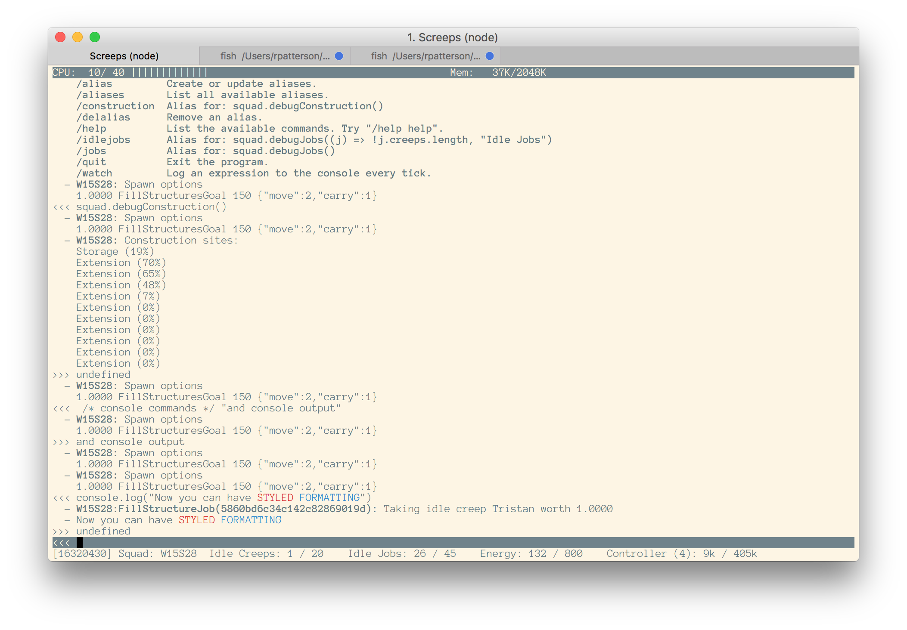

[](https://nodei.co/npm/screeps-multimeter/)

# screeps-multimeter
Multimeter is a hackable console for the game [Screeps](https://screeps.com/). It lets you access your Screeps console without loading up the full website (and as a result lets you play Screeps for much longer on a single battery charge), and is hackable with plugins.




Features:
- Terminal (command line) program, no browser or GUI required.
- Send console commands from the program.
- Rich console output formatting.
- Add plugins to get new functionality.

## Installation

```
npm install -g screeps-multimeter
multimeter
```

When you run multimeter for the first time, it will ask you for your [Screeps API token](http://docs.screeps.com/auth-tokens.html) and save it into a config file in the current directory.
You will also need to specify the name of the shard to use.

The main interface has a command line on the bottom. In type `/help` to see a list of the available commands. Type `/quit` to exit the program.

## Colors and Formatting

Console coloring and formatting is made possible by [blessed's tags](https://github.com/chjj/blessed#content--tags). Some of the tags you can use are:

- `{color-fg}` - Change the foreground color.
- `{color-bg}` - Change the background color.
- `{bold}, {underline}, {blink}, {inverse}, {invisible}` - Apply the character style.
- `{/style}` - Stop using the given style, e.g. `{/bold}`.
- `{/}` - Reset to normal characters.
- `{|}` - Align the rest of the line to the right.

Colors can be specified as a name, e.g. red, blue, yellow, cyan (see [colorNames from blessed](https://github.com/chjj/blessed/blob/eab243fc7ad27f1d2932db6134f7382825ee3488/lib/colors.js#L312) for a complete list), or as a hex code, e.g. `#ffff00`.

## Plugins

Multimeter currently ships with these plugins enabled by default. To select which plugins are loaded, edit the `plugins` array in your `screeps-multimeter.json`.

### Plugin: Alias

The alias plugin can be used to easily store and access commonly used console commands. Create a new alias by using `/alias NAME COMMAND`. Now, `/NAME` will automatically expand to `COMMAND`. For example, this alias will let you list all damaged creeps by typing `/damagedCreeps`:

```
/alias damagedCreeps _.filter(Game.creeps, (c) => c.hits < c.hitsMax)
/damagedCreeps
```

Aliases can also take parameters. There will be available in variables like `$1`, `$2`, etc. The entire passed string is available as `$args`. For example:

```
/alias hitsLeft "Creep " + $1 + " has " + Game.creeps[$1].hits + " hits left"
/hitsLeft Ryan
```

### Plugin: Watch

The watch plugin will log an expression to your console on every tick. To install it, copy [watch-client.js](lib/watch-client.js) to your script and add some code to your `loop` function:

```
var watcher = require('watch-client');
exports.loop = function() {
  // Rest of your code...

  watcher();
};
```

There are two ways to watch expressions. You can log it to the console normally by using `/watch console EXPR`. You can also log to a status bar at the bottom of the screen using `/watch status EXPR`. For example, `/watch status _.keys(Game.creeps).length` will keep a count of the number of live creeps at the bottom of the terminal.

## Contributing

If you have feedback, bugs, or feature requests for multimeter, don't hesitate to look through [the issues](https://github.com/CGamesPlay/screeps-multimeter/issues) and add your thoughts. Please search to see if someone else has already filed a related issue before you submit a new one.

Multimeter is built for hacking! The easiest way to add a feature to multimeter is to make a new plugin for it. If you need to change something and it can't be done with a plugin, you can fork multimeter and submit a pull request. Ideally, you can add the necessary hooks so that other plugins can take advantage of them.

### Contributors

Multimeter has been built by a collection of users. Github provides a [list of all contributors to the project](https://github.com/screepers/screeps-multimeter/graphs/contributors).

## Publishing

To release a new version:

- Update the version in package.json to `$VERSION` and commit.
- `git tag v$VERSION`
- `git push origin v$VERSION`
- `npm publish`
- `open https://github.com/screepers/screeps-multimeter/releases/new?tag=v$VERSION`

Name the release "$VERSION released" and write the release notes using these bullet point templates:

- Bugfix: some bug in some circumstance (by User)
- New feature: something that used to not exist but now does (by User)
